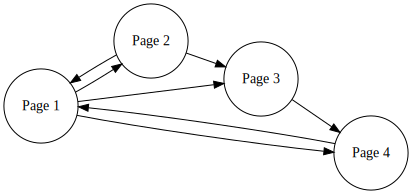

Octave Code Example for PageRank
==================================================

This is a short guide for calculating pagerank in Octave.  It's mainly
for the purpose of being illustrative for how the algorithm works, and
why matricies are involved.

## Example Network

## Adjacency Matrix

First thing to do is start with an Adjacency matrix, which is one way
to describe directed graphs.

I started by just marking 1 if there was a link, and 0 if there
wasn't.  This is a matrix format for a standard directed graph.

~~~octave
G = [
	0 1 0 1
	1 0 0 0
	1 1 0 0
	1 0 1 0
]
~~~

Using this, we already have some information.  The sum of a column is
the number of outbound links.  The sum of a row is the number of
inbound links. In the example above, the first webpage has 3 outgoing
links, and 2 ingoing links.

## Hyperlink Matrix

Now we can caclulate the hyperlink matrix.

The sum of a column is the number of outbound links for that node.
sum(G) returns a vector (1 by n) with each column's sum.  `1 ./ sum(G)`
returns a vector(1 by n) with 1/sum(col) in each value.  the whole
expression returns the HYPERLINK MATRIX.

~~~octave
hyperlinkMatrix = (1 ./ sum(G))  .* G
~~~

the symbols `./` and `.*` are octaves way of doing an element by
element operation, we could achieve the same thing using `for` loops.

~~~
hyperlinkMatrix =

   0.00000   0.50000   0.00000   1.00000
   0.33333   0.00000   0.00000   0.00000
   0.33333   0.50000   0.00000   0.00000
   0.33333   0.00000   1.00000   0.00000
   
~~~

Notice that for this matrix, if you take the sum of each column, they
now each equal 1.  You could think about it like this: you are
splitting up the value of your outbound links.  If you make a webpage
and have 5 links, then each of those links will be assigned a value of
1/5.

~~~octave
sum(hyperlinkMatrix)
~~~

~~~
ans =

   1   1   1   1

~~~

## Pagerank

The Pagerank algorithm is recursive, it uses the old pagerank to
calculate to new pagerank. Since the algorithm *converges* to a
specific value, you basically just run it a bunch of times until it
stops changing.

We will store the pagerank as a 1-column vector, with each row
corresponding to a page.  To initialize, we just set one of the pages
to a pagerank of 1, and the rest to 0.

In octave, this can be done using the `zero(m, n)`
function, followed by setting 1 of the values to 1.

~~~octave
n = rows(G);
pagerank = zeros(n, 1);
pagerank(1,1) = 1;
~~~

Here's what the pagerank vector looks like when its initialized:

~~~
pagerank =

   1
   0
   0
   0
   
~~~

## Calculating the Pagerank

Woo, now we are ready to calculate the pagerank!  Now that we've set
up our vectors and matricies in a nice way, it's actually pretty easy.

~~~octave
nIters = 100;

for i = [1:nIters]
  pagerank = hyperlinkMatrix * pagerank;
endfor
~~~

And now we have our pagerank of each page!

~~~
pagerank =

   0.37500
   0.12500
   0.18750
   0.31250
   
~~~

**WOOT! WE ARE DONE!**

## Other stuff to try

Try calculating the pagerank with different number of iterations, or
track the pagerank as it changes over time.  You'll notice how it
converges.

~~~octave
tracker = pagerank;
for i = [1:10]
  pagerank = hyperlinkMatrix * pagerank;
  tracker = horzcat(tracker, pagerank);
endfor
~~~

This code just places the column vectors side by side each time a new
one is calculated. Printing out `tracker` will show how the pagerank
changed over time.  The first column is how it started, and the last
column is the most recent calculation.

~~~
tracker =

   1.00000   0.00000   0.50000   0.33333   0.41667   0.33333   0.40278   0.36111   0.38194   0.37037   0.37847
   0.00000   0.33333   0.00000   0.16667   0.11111   0.13889   0.11111   0.13426   0.12037   0.12731   0.12346
   0.00000   0.33333   0.16667   0.16667   0.19444   0.19444   0.18056   0.18981   0.18750   0.18750   0.18711
   0.00000   0.33333   0.33333   0.33333   0.27778   0.33333   0.30556   0.31481   0.31019   0.31481   0.31096

~~~

Notice how the last few columns (which represent the last few
iterations), don't change very much.  This shows how the algorithm is
convergent.

We can use this to show that it doesn't matter too much how we
intialize the pagerank vector. Here's what happens when you assign the
1 value to the 3rd node instead of the 1st.

~~~
asdf =

   0.00000   0.00000   1.00000   0.00000   0.50000   0.33333   0.41667   0.33333   0.40278   0.36111   0.38194
   0.00000   0.00000   0.00000   0.33333   0.00000   0.16667   0.11111   0.13889   0.11111   0.13426   0.12037
   1.00000   0.00000   0.00000   0.33333   0.16667   0.16667   0.19444   0.19444   0.18056   0.18981   0.18750
   0.00000   1.00000   0.00000   0.33333   0.33333   0.33333   0.27778   0.33333   0.30556   0.31481   0.31019
   
~~~

Notice that, although the values are a little bit different after only
10 iterations, they are approaching the same values.
